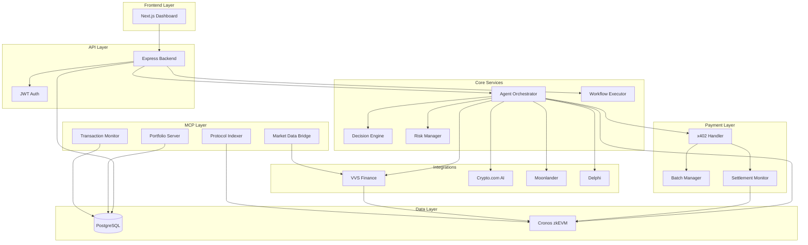

# Architecture Overview

## System Architecture

## Component Descriptions

### Frontend Layer

**Next.js Dashboard**: User interface for managing agents, workflows, and viewing transactions. Built with React, TailwindCSS, and Shadcn/UI components.

### API Layer

**Express Backend**: RESTful API serving authentication, CRUD operations for agents/workflows, and developer tools.

**JWT Auth**: Token-based authentication for securing API endpoints.

### Core Services

#### Agent Orchestrator
The central execution engine that manages the lifecycle of autonomous agents. It:
- Fetches agent configuration from the database
- Retrieves market and wallet state
- Delegates decisions to the Decision Engine
- Validates actions through the Risk Manager
- Executes transactions or delegates to x402

#### Decision Engine
AI-powered decision making for agents. Currently implements heuristic-based logic but designed to plug in real AI models (OpenAI, Anthropic, Gemini):
- Analyzes market state (prices, balances, positions)
- Generates actions based on strategy
- Returns structured action objects

#### Risk Manager
Safety layer that validates all agent actions before execution:
- Checks transaction amounts against limits
- Validates token allowlists
- Prevents unauthorized operations
- Returns pass/fail with reasons

#### Workflow Executor
Handles multi-step automation scenarios:
- Parses workflow JSON from database
- Executes steps sequentially (ACTION, DELAY, CONDITION)
- Updates workflow status
- Triggers Agent Orchestrator for action steps

### Payment Layer (x402)

#### X402 Handler
Manages payment protocol interactions:
- Requests quotes from facilitators
- Constructs payment transactions
- Coordinates with settlement monitor

#### Secure Batch Payments (Encrypted Distributions)
Optimizes multiple payments into batches:
- Queues individual payments
- Combines into Merkle trees
- Submits single on-chain transaction

#### Settlement Monitor
Verifies payment completion:
- Polls blockchain for transaction confirmation
- Validates settlement proofs
- Updates payment status

### Protocol Integrations

#### VVS Finance Integration
Real, live integration with VVS DEX on Cronos:
- Calls `getAmountsOut` on VVS Router contract
- Returns real swap quotes
- Maps token symbols to addresses

#### Crypto.com AI Integration
Mock integration for AI-powered tools:
- Market sentiment analysis
- Price predictions

#### Moonlander & Delphi
Mock integrations demonstrating extensibility.

### Data Layer

**PostgreSQL**: Primary datastore for users, agents, workflows, and transactions.

**Cronos EVM**: Blockchain layer for wallet management, transaction execution, and DeFi protocol interaction.

### MCP Layer

Model Context Protocol servers expose SyncFlow data to AI models:

- **Portfolio Server**: Agent balances and positions
- **Transaction Monitor**: Recent transaction history
- **Protocol Indexer**: Searchable protocol data
- **Market Data Bridge**: Real-time price feeds

## Data Flow: Agent Execution Cycle

1. **Trigger**: Scheduled job or manual trigger calls `AgentOrchestrator.executeCycle(agentId)`
2. **Fetch State**: Orchestrator loads agent config and queries blockchain for balances
3. **Make Decision**: Decision Engine analyzes state and returns an action (e.g., "SWAP 1 CRO for USDC")
4. **Validate**: Risk Manager checks if action is allowed
5. **Execute**: 
   - For swaps: VVS Integration fetches quote, constructs transaction
   - For payments: x402 Handler coordinates settlement
6. **Record**: Transaction logged to database
7. **Settlement**: Settlement Monitor watches blockchain for confirmation

## Security Considerations

- **Private Keys**: Currently stored in database for dev/hackathon. Production would use HSM or MPC
- **Risk Management**: Hard limits on transaction sizes and token allowlists
- **JWT Auth**: API endpoints require valid tokens
- **Input Validation**: Zod schemas validate all API inputs

## Scalability

- **Agent Isolation**: Each agent runs independently
- **Batch Optimization**: x402 reduces on-chain footprint
- **MCP Caching**: Frequent queries can be cached
- **Workflow Parallelization**: Future enhancement to run steps concurrently

## Technology Choices

**Node.js/TypeScript**: Type safety, rich ecosystem, easy async operations  
**Express**: Lightweight, flexible, well-documented  
**Prisma**: Type-safe ORM, excellent migrations  
**Ethers.js v6**: Industry standard for Ethereum interactions  
**Next.js**: SSR, routing, and optimizations out of the box  
**PostgreSQL**: ACID compliance, JSON support, mature
